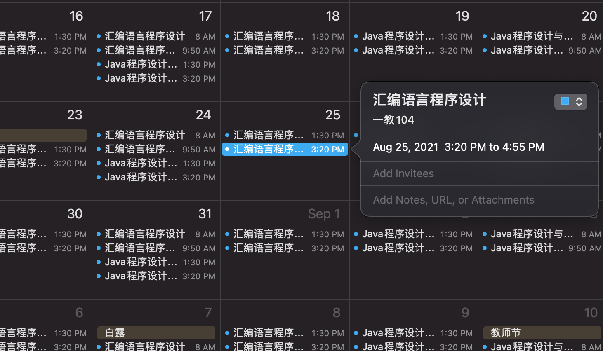

# thucal

Download the course arrangement from info, convert into a ICS file.

## Usage

1. Login [info](http://zhjw.cic.tsinghua.edu.cn/jxmh.do?m=bks_jxrl_all) with your credential 

2. open dev tool and find the cookie with key `JSESSIONID`, which should be a string
3. run `npm install` to install the deps.
4. run `node . -c JSESSIONID=<your cookie> -o cal.ics`
5. double click the ICS file.

It's recommand that setup a dedicate calendar for the course. Finally you can get course like this. 

